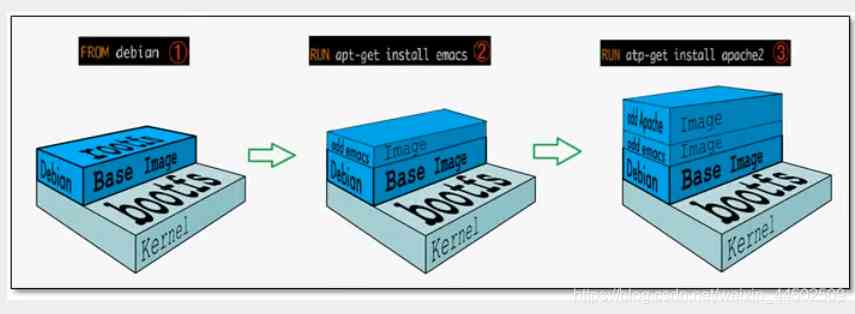
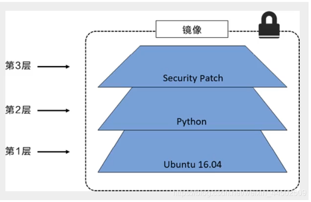
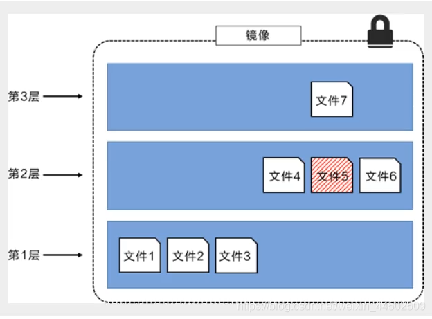
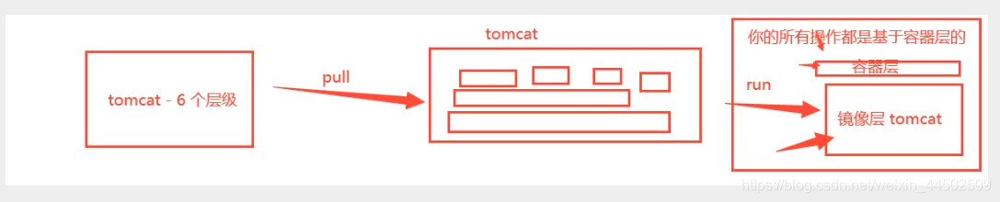

# Docker镜像

镜像就是一个轻量级的，可执行的独立软件包，用来打包软件运行环境和基于运行环境开发的软件，它包含运行某个软件所需的所有内容，包括代码，运行所需要的库，环境变量和配置文件。

**获取镜像的方式：**

- docker pull
- 使用Dockerfile构建镜像
- 镜像打包成文件

## Docker镜像加载原理

> UnionFs（联合文件系统查询）

UnionFs(联合文件系统): Union文件系统(UnionFS)是一种分层，轻量级并且高性能的文件系统，它支持对文件系统的修改作为一次提交来一层层的叠加，同时可以将不同目录挂载到同一个虚拟文件系统下，Union文件系统是Docker镜像的基础，镜像可以通过分层来进行继承，基于基础镜像(没有父镜像)，可以制作各种具体的应用镜像.

特性: 一次同时加载多个文件系统，但从外面看起来，只能看到一个文件系统，联合加载会把各层文件系统叠加起来，这样最终的文件系统会包含所有底层的文件和目录结构.

rootfs(root file system),在bootfs之上,包含的就是典型Linux系统中的/dev, /proc,/bin, /etc等标准目录和文件,rootfs就是各种不同的操作系统发行版,比如Ubuntu, CentOS等等



对于一个精简的OS,rootfs可以很小,只需要包含基本的命令,工具和程序库就可以了,因为底层直接用Host的kernel,自己只需要提供rootfs就可以了。由此可见对于不同的linux发行版,bootfs基本是一致的,rootfs会有差别,因此不同的发行版可以共用bootfs。

## 分层原理

> 分层镜像

最大好处,莫过于资源共享了!比如有多个镜像都从相同的Base镜像构建而来,那么宿主机只需在磁盘上保留一份base镜像,同时内存中也只需要加载一份base镜像,这样就可以为所有的容器服务了,而且镜像的每一层都可以被共享

所有的镜像都起始于一个基础镜像层,当进行修改或增加新的内容时,就会在当前镜像层之上,创建一个新的镜像层,

举一个简单的例子,假如基于Ubuntu Linux 16.64创建一个新的镜像,这就是新镜像的第一层,如果在该镜像中添加python包,就会在该镜像之上创建第二个镜像层; 如果继续添加一个安全补丁,就会创建第三个镜像层



下图中在外部看来整个镜像只有6个文件,这是因为最上层的文件7是文件5的一个更新版本



上层镜像层中的文件覆盖了底层镜像层中的文件,这样就使得文件的更新版本作为一个新镜像层添加到镜像当中

Docker通过存储引擎(新版本采用快照机制)的方式来实现镜像层堆栈,并保证多层镜像层对外展示为统一的文件系统

Lunux上可用的存储引擎有AUFS,Overlay2,Device Mapper,Btrfs以及ZFS,顾名思义,每种存储引擎都是基于Linux对应的文件系统或者块设备技术,并且每种存储引擎都有其独有的性能特点

> 特点

Docker镜像都是只读的,当容器启动时,一个新的可写层被加载到镜像的顶部!

这一层就是我们通常所说的容器层,容器之下的都叫镜像层



## commit镜像

将当前容器保存为镜像

```shell
docker commit 提交容器成为一个新的镜像
# 命令和git原理类似
docker commit -m="提交的描述信息" -a="作者" 容器ID 目标镜像名:[tag]
```

