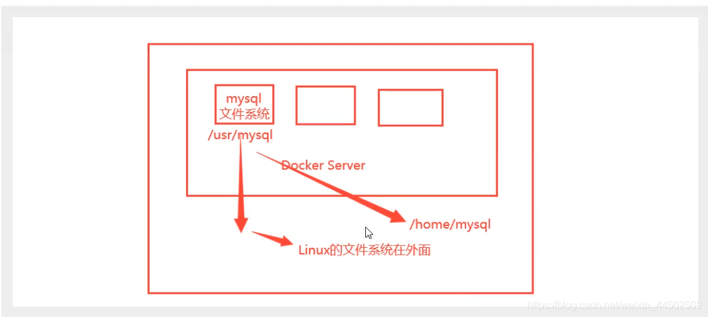
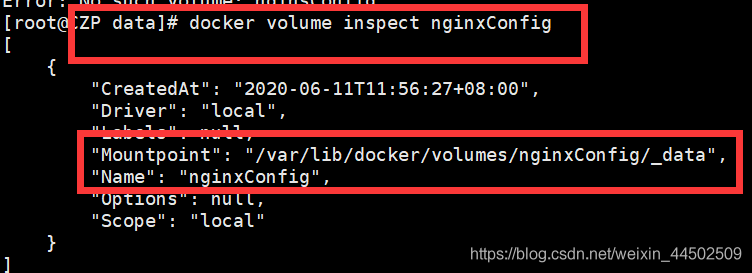
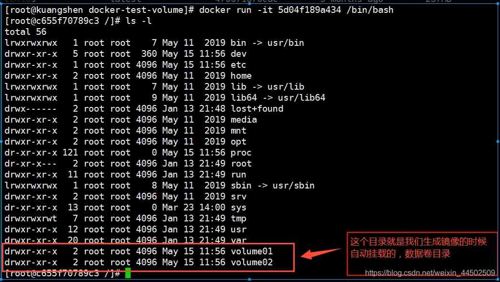
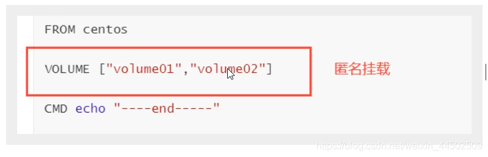
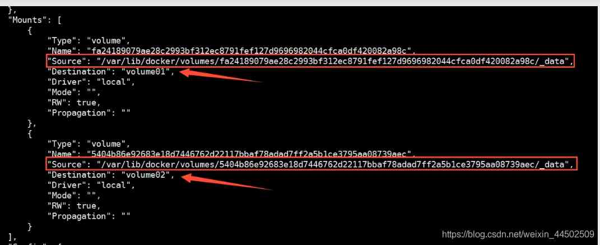
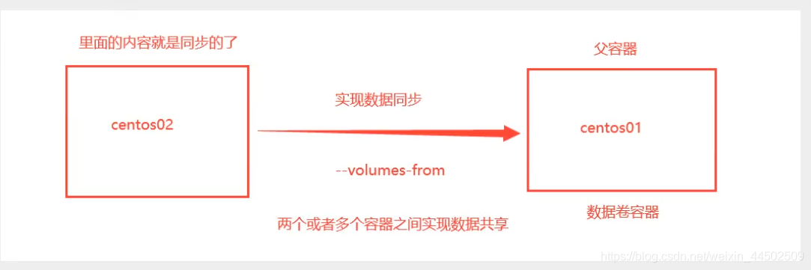
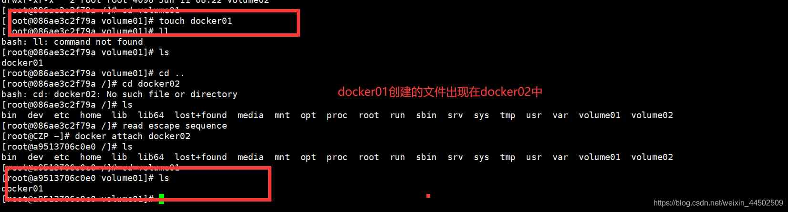
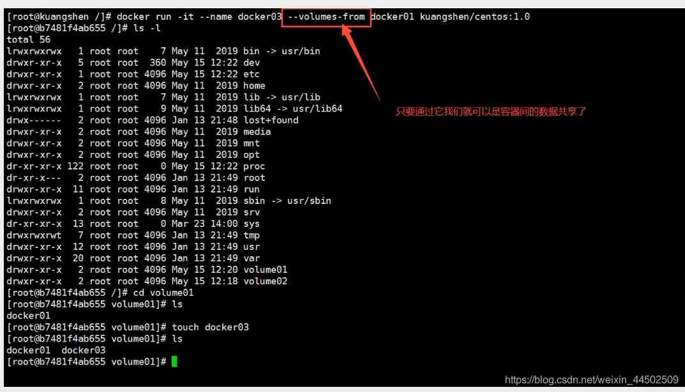
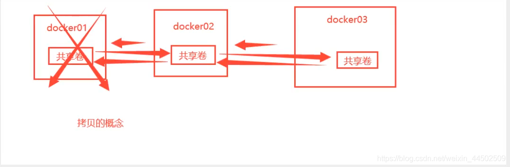

# 容器数据卷

如果数据都在容器中,那么我们容器删除,数据就会丢失! 需求: 数据可以持久化

MYSQL, 容器删了,删库跑路! 需求: mysql数据可以存储在本地!

容器之间可以有一个数据共享的技术! Docker 容器中产生的数据,同步到本地!

这就是卷技术! 目录的挂载,将容器内的目录挂载到Linux上面!



**容器的持久化和同步操作! 容器间也可以数据共享的!**

## 使用数据卷

> 方式一：直接使用命令来挂载 -v

```shell
docker run -v 宿主机目录:容器内目录(绝对地址)
```

### 具名与匿名挂载

```shell
# 匿名挂载
-v 容器内路径（只写了容器内路径）
docker -run -P -name nginx01 -v /etc/nginx nginx
# 查看所有的卷的情况
[root@CZP data]# docker volume ls
local 2c04226b82b31e3cddb80b5fffa17685883ff8c256024525b3a65b07b8281110
# 这里发现,这种就是匿名挂载, 我们在 -v只写了容器内的路径,没有写容器外的路径
# 具名挂载
[root@CZP data]# docker run -d -p 9099:80 -v nginxConfig:/etc/nginx 2622e6cca7eb
bd7ebf502166e5569ea3fb5eddaf41f4ff9a70df62b9143861dd702ae8c1cb31
[root@CZP data]# docker volume ls
DRIVER VOLUME NAME
local nginxConfig
# 通过 -v 卷名:容器内路径
```



所有的docker容器内的卷,没有指定目录的情况下都是在/var/lib/docker/volumes/卷名/_data

我们通过具名挂载可以方便的找到一个卷,大多数情况在使用的’具名挂载’

```shell
# 如何确定是具名挂载还是匿名挂载,还是指定路径挂载
-v 容器内路径 # 匿名挂载
-v 卷名:容器内路径 # 具名挂载
-v 宿主机路径 : 容器内路径 # 指定路径挂载
```

```
# 通过 -v 宿主机:容器内路径: ro rw 改变读写权限
ro read only
read and write
# 一旦设置了容器权限,容器对挂载出来的内容就有限定了!
docker -run -P -name nginx01 -v nginx:/etc/nginx:ro nginx
docker -run -P -name nginx01 -v nginx:/etc/nginx:rw nginx
ro : 只要看到ro就说明这个路径只能通过宿主机来改变,容器内部无法操作
```

> 方式二：通过Dockerfile

```dockerfile
# 创建一个dockerfile文件,名字可以随机 建议 dockerfile
# 文件中的内容
FROM centos
VOLUME ["volume01","volume02"]
CMD echo "---end---"
CMD /bin/hash
```



这个卷和外部一定有一个同步的目录



查看一下卷挂载的路径



## 数据卷容器

两个容器之间实现数据共享







```shell
# 测试: 可以删除docker01,查看一下docker02和docker03是否还可以访问这个文件
# 测试依旧可以访问
```



容器之间配置信息的传递,数据卷容器的生命周期一直持续到没有人使用为止

但是一旦你持久化到了本地,这个时候,本地的数据是不会删除的
