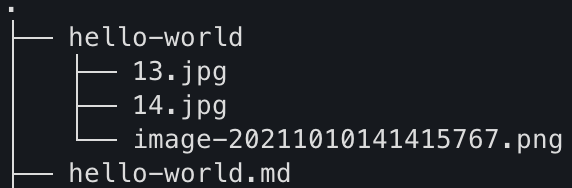

为了兼顾`Markdown`格式的简洁，所以采用了`hexo-asset-image`插件~

<!--more-->

1. 修改_config.yml配置文件

   将post_asset_folder这个配置设置为true，这个配置的作用是在使用hexo n 命令时会新建一个与md文件同名的文件夹，修改之后如下：

   

2. 安装hexo-asset-image插件

   ```bash
   npm install hexo-asset-image --save
   ```

3. 使用Markdown格式插入图片

   ``

### PS:

其实Hexo官方有相关的语法，但是这边为了使用Markdown语法，追求简单，所以采用了插件的形式。

另外官方也有推荐相关的插件，但是个人觉得那个插件太庞大了，很多功能都没来得及了解，暂时就用hexo-asset-image插件。

个人在插图上踩到的坑：

- 文件名称中尽量不要带空格，可能解析错误
- 网页渲染不一定及时，有时需要等待一会
- 网页可能存在缓存，清理一下缓存之后重新打开就恢复正常了
