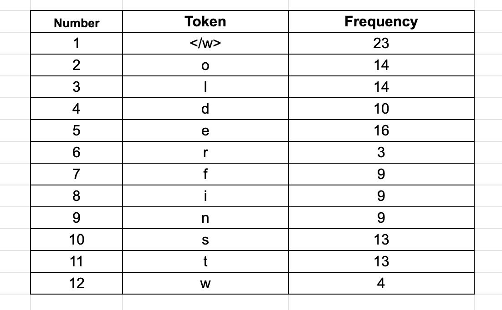
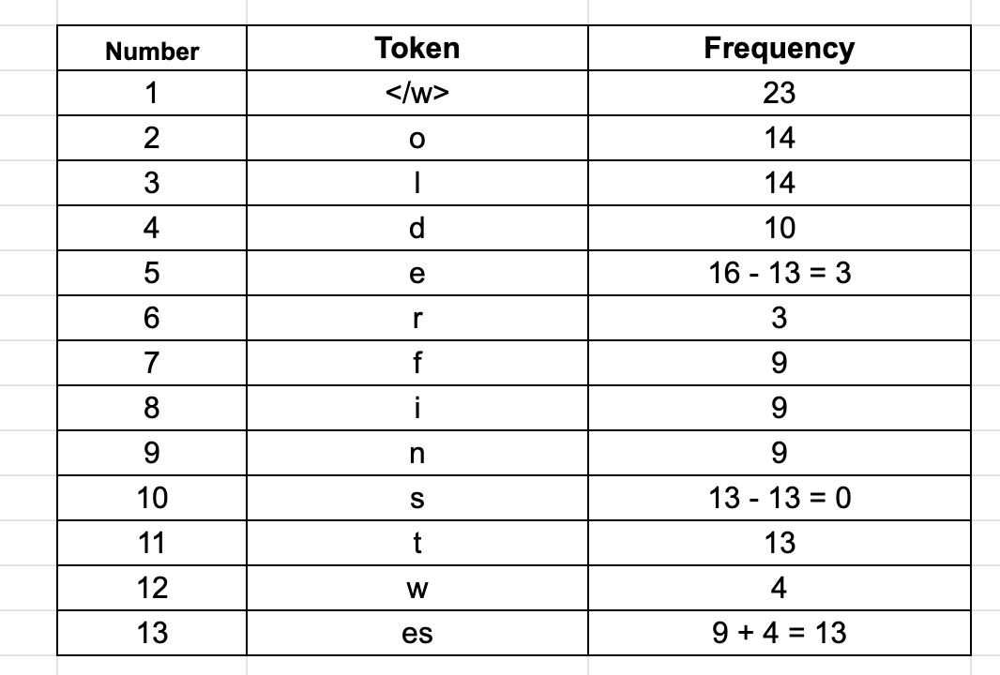
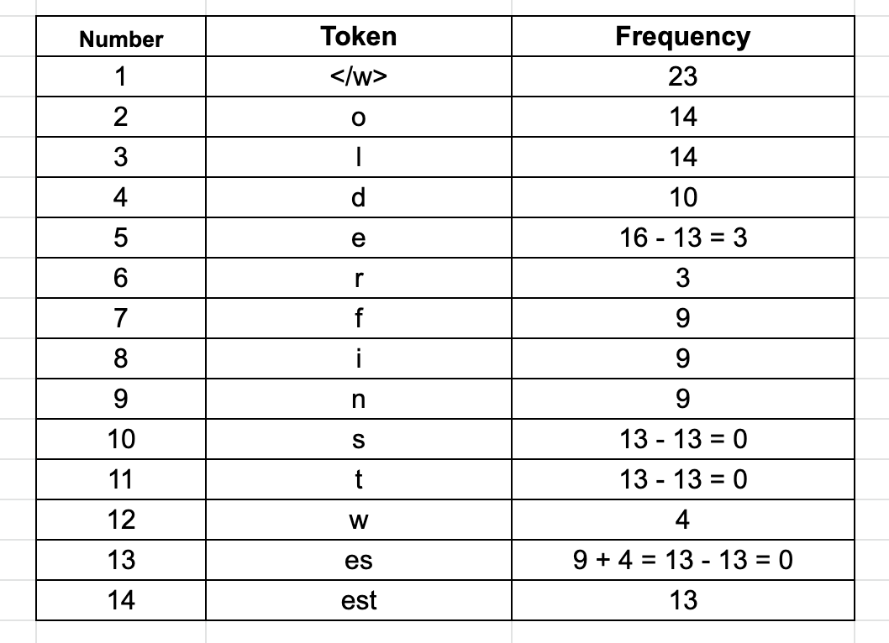
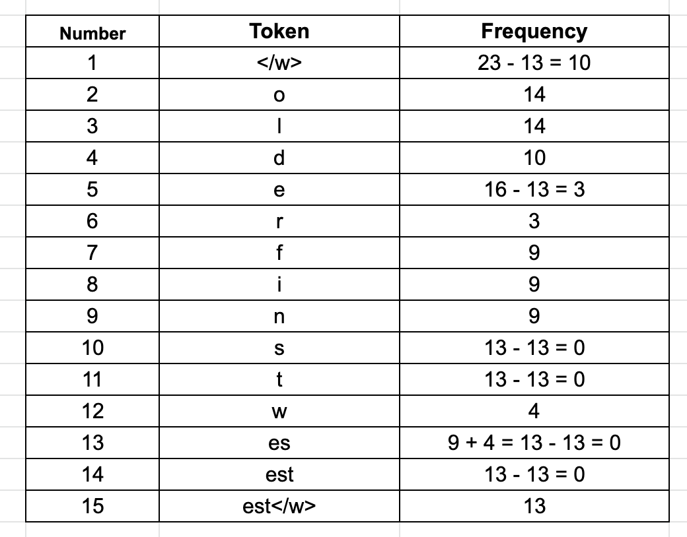
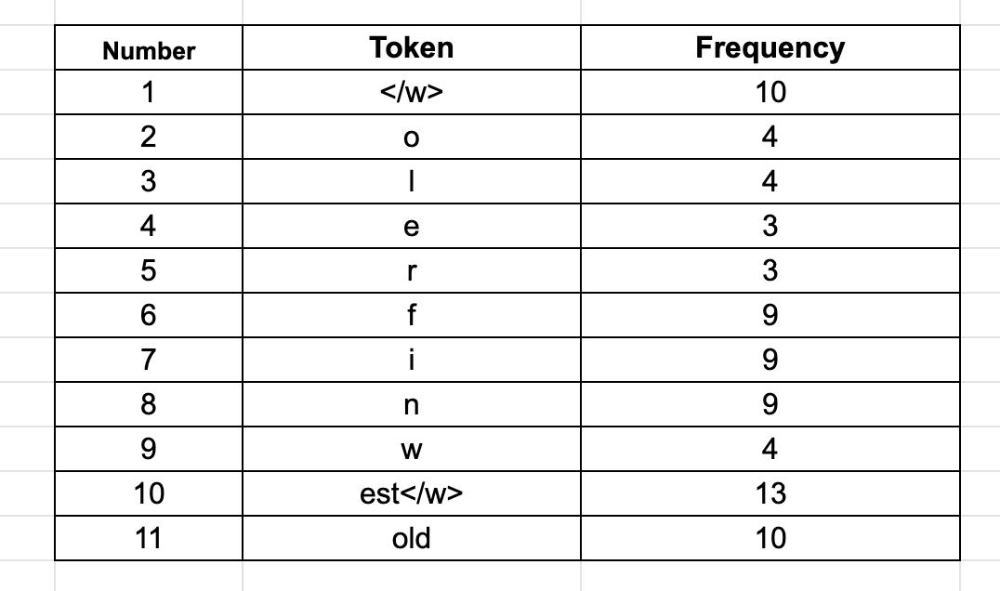
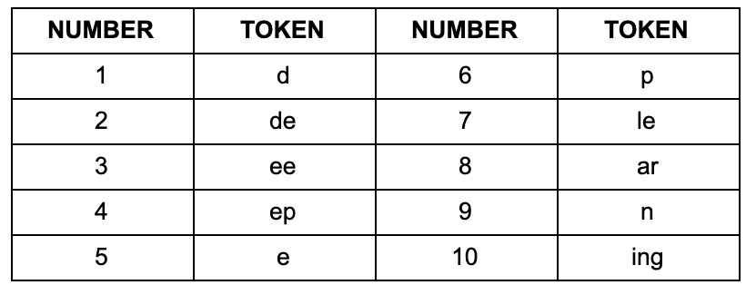
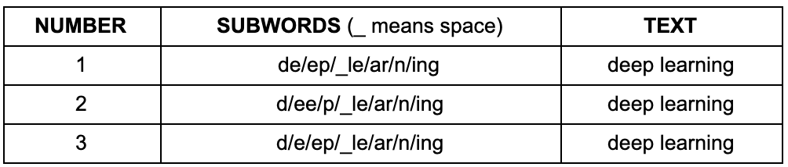

## Subword-based Tokenization

基于子词的Tokenization是介于基于字和基于字符的标记化之间的一种解决方案。其主要思想是解决基于单词的标记化（非常大的词汇量、大量的OOV词以及非常相似的单词的不同含义）和基于字符的标记化（非常长的序列和意义较小的单个标记）所面临的问题。基于子词的Tokenization算法不会将频繁使用的词拆分为更小的子词。它将罕见的单词拆分成更小的有意义的子单词。例如，`boy`没有拆分，但`boys`被拆分为`boy`和`s`。这有助于模型了解`boys`一词是由`boy`一词构成的，意思稍有不同，但词根相同。

现在比较流行的子词Tokenization算法有WordPiece、字节对编码（BPE）、Unigram和SentencePiece。BPE用于语言模型，如GPT-2、RoBERTa、XLM、FlauBERT等。其中一些模型使用space tokenization作为pre-tokenization方法，而一些模型使用Moses、spaCY、ftfy提供的更高级的pre-tokenization方法。

<!-- more -->

### BPE

假设我们有需要编码（压缩）的数据aaabdaabac。字节对aa最常出现，因此将用Z替换它，因为Z不出现在数据中。现在有了ZabdZabac，其中Z=aa。下一个公共字节对是ab，用Y替换它。现在有了ZYdZYac，其中Z=aa和Y=ab。剩下的唯一字节对是ac，它只显示为一个，所以我们不会对它进行编码。我们可以使用递归字节对编码将ZY编码为X。我们的数据现在已经转换为XdXac，其中X=ZY，Y=ab，Z=aa。无法进一步压缩，因为没有多次出现的字节对。我们通过按相反顺序执行替换来解压缩数据。

在NLP中，BPE确保最常见的单词在词汇表中作为单个token表示，而罕见的单词被分解为两个或多个子单词token，这与基于子词的Tokenization算法的功能是一致的。假设有一个语料库，其中包含单词（在基于空间的预标记化之后）——old、older、highter和lower，我们计算这些单词在语料库中出现的频率。假设这些单词的频率如下：

`{“old”: 7, “older”: 3, “finest”: 9, “lowest”: 4}`

在每个单词的末尾添加一个特殊的结尾标记`</w>`。

`{“old</w>”: 7, “older</w>”: 3, “finest</w>”: 9, “lowest</w>”: 4}`

在每个单词末尾添加“</w>”标记以标识单词边界，以便算法知道每个单词的结尾。这有助于算法查看每个字符并找到频率最高的字符配对。我将在稍后的字节对中包含“</w>”时详细解释这一部分。

把每个单词分成几个字符，并计算它们的出现次数。初始标记将是所有字符和“</w>”标记。



因为总共有23个单词，所以我们有23个“</w>”标记。第二高频率标记是“e”。我们总共有12种不同的token。

BPE算法的下一步是寻找最频繁的字节对，合并它们，并一次又一次地执行相同的迭代，直到达到token限制或迭代限制。通过合并，您可以使用最少数量的标记来表示语料库，这是BPE算法的主要目标，即数据压缩。要进行合并，BPE将查找最常表示的字节对。在这里，认为字符与字节相同。这在英语中是一种情况，在其他语言中可能有所不同，比如中文（中文可真是博大精深）。

现在，将合并最常见的字节对以生成一个token，并将它们添加到token列表中，并重新计算每个token的出现频率。这意味着每个token频率计数将在每个合并步骤后改变。将继续执行此合并步骤，直到达到迭代次数、达到vocab_size限制或者下一个最高频的字节对出现频率为 1。

#### 迭代过程

1. 从第二个最常见的标记“e”开始。在语料库中，当前最常见的带有“e”的字节对是“e”和“s”，它们出现了9+4=13次。我们将它们合并成一个新的标记“es”，并记下它的频率为13。我们还将减少单个token（“e”和“s”）的计数13。这将让我们知道剩余的“e”或“s”标记。我们可以看到“s”根本不是单独出现的，“e”则是出现了3次。以下是更新后的表格：



2. 合并标记“es”和“t”，因为它们在语料库中出现了13次。因此，我们有一个频率为13的新标记“est”，我们将把“es”和“t”的频率降低13。



3. 字节对“est”和“</w>”在我们的语料库中出现了13次。因此，我们有一个频率为13的新标记“est</w>”，我们将把“est”和“</w>”的频率降低13。



注意：合并停止token“</w>”非常重要。这有助于算法理解“estimate”和“highest”等词之间的区别。这两个词都有“est”的共同点，但其中一个词的结尾和开头分别有一个“est”标记。因此，像“est”和“est</w>”这样的标记将得到不同的处理。如果算法将看到标记“est</w>”，它将知道它是单词“highest”的标记，而不是单词“estate”。

4. 按照此方法依次迭代，将会得到一下表格：



现在可以看到，token总数是11，这比最初的计数12要少。这是一个很小的语料库，但在实践中，语料库的大小应该会减少很多。这11个标记的列表将作为我们的词汇表。当我们添加token时，我们的计数会增加或减少，或者保持不变。实际上，token计数先增加后减少。停止标准可以是迭代次数、达到vocab_size限制或者下一个最高频的字节对出现频率为 1。我们选择停止标准，以便我们的数据集可以以最有效的方式分解为子词。

#### BPE实现

```python
import re, collections

def get_vocab(filename):
    vocab = collections.defaultdict(int)
    with open(filename, 'r', encoding='utf-8') as fhand:
        for line in fhand:
            words = line.strip().split()
            for word in words:
                vocab[' '.join(list(word)) + ' </w>'] += 1
    return vocab

def get_stats(vocab):
    pairs = collections.defaultdict(int)
    for word, freq in vocab.items():
        symbols = word.split()
        for i in range(len(symbols)-1):
            pairs[symbols[i],symbols[i+1]] += freq
    return pairs

def merge_vocab(pair, v_in):
    v_out = {}
    bigram = re.escape(' '.join(pair))
    p = re.compile(r'(?<!\S)' + bigram + r'(?!\S)')
    for word in v_in:
        w_out = p.sub(''.join(pair), word)
        v_out[w_out] = v_in[word]
    return v_out

def get_tokens(vocab):
    tokens = collections.defaultdict(int)
    for word, freq in vocab.items():
        word_tokens = word.split()
        for token in word_tokens:
            tokens[token] += freq
    return tokens

vocab = {'l o w </w>': 5, 'l o w e r </w>': 2, 'n e w e s t </w>': 6, 'w i d e s t </w>': 3}

# Get free book from Gutenberg
# wget http://www.gutenberg.org/cache/epub/16457/pg16457.txt
# vocab = get_vocab('pg16457.txt')

print('==========')
print('Tokens Before BPE')
tokens = get_tokens(vocab)
print('Tokens: {}'.format(tokens))
print('Number of tokens: {}'.format(len(tokens)))
print('==========')

num_merges = 1000
for i in range(num_merges):
    pairs = get_stats(vocab)
    if not pairs:
        break
    best = max(pairs, key=pairs.get)
    vocab = merge_vocab(best, vocab)
    print('Iter: {}'.format(i))
    print('Best pair: {}'.format(best))
    tokens = get_tokens(vocab)
    print('Tokens: {}'.format(tokens))
    print('Number of tokens: {}'.format(len(tokens)))
    print('==========')

    
'''输出结果'''
==========
Tokens Before BPE
Tokens: defaultdict(<class 'int'>, {'l': 7, 'o': 7, 'w': 16, '</w>': 16, 'e': 17, 'r': 2, 'n': 6, 's': 9, 't': 9, 'i': 3, 'd': 3})
Number of tokens: 11
==========
Iter: 0
Best pair: ('e', 's')
Tokens: defaultdict(<class 'int'>, {'l': 7, 'o': 7, 'w': 16, '</w>': 16, 'e': 8, 'r': 2, 'n': 6, 'es': 9, 't': 9, 'i': 3, 'd': 3})
Number of tokens: 11
==========
Iter: 1
Best pair: ('es', 't')
Tokens: defaultdict(<class 'int'>, {'l': 7, 'o': 7, 'w': 16, '</w>': 16, 'e': 8, 'r': 2, 'n': 6, 'est': 9, 'i': 3, 'd': 3})
Number of tokens: 10
==========
Iter: 2
Best pair: ('est', '</w>')
Tokens: defaultdict(<class 'int'>, {'l': 7, 'o': 7, 'w': 16, '</w>': 7, 'e': 8, 'r': 2, 'n': 6, 'est</w>': 9, 'i': 3, 'd': 3})
Number of tokens: 10
==========
Iter: 3
Best pair: ('l', 'o')
Tokens: defaultdict(<class 'int'>, {'lo': 7, 'w': 16, '</w>': 7, 'e': 8, 'r': 2, 'n': 6, 'est</w>': 9, 'i': 3, 'd': 3})
Number of tokens: 9
==========
Iter: 4
Best pair: ('lo', 'w')
Tokens: defaultdict(<class 'int'>, {'low': 7, '</w>': 7, 'e': 8, 'r': 2, 'n': 6, 'w': 9, 'est</w>': 9, 'i': 3, 'd': 3})
Number of tokens: 9
==========
```

#### Encoding 与 Decoding

要解码，只需简单地将所有标记连接在一起，以获得整个单词。

例如，

编码序列:

`[“the</w>”，“high”，“est</w>”，“range</w>”，“in</w>”，“sattle</w>”]`

将被解码为:

`[“the”，“high”，“estrange”，“in”，“in”，“settle”]`

注意“est”中存在“</w>”标记。

对于新数据的编码，过程同样简单。然而，编码本身在计算上是昂贵的。

假设单词的顺序是:

`[“the</w>”、“highest</w>”、“range</w>”、“in</w>”、“sattle</w>”]`

我们将遍历在语料库中找到的所有标记—从最长到最短，并尝试使用这些标记替换给定单词序列中的子字符串。最终，我们将遍历所有token，子字符串将替换为token列表中已经存在的token。如果剩下几个子字符串（对于我们的模型在训练中没有看到的单词），将用`unk`替换它们。

总的来说，词汇量很大，但仍有可能出现未知单词。实际上，我们将预先标记的单词保存在字典中。对于未知（新）单词，我们应用上述编码方法对新词进行标记化，并将新词的标记化添加到词典中以供将来参考。这有助于我们为将来建立更强大的词汇量。

在编码是使用的是贪心的思想，为了以最有效的方式表示语料库，BPE通过查看每次迭代的频率来检查每个潜在的合并选项。因此，它遵循贪心策略的方法来优化最佳可能的解决方案。无论如何，BPE是应用最广泛的子字标记化算法之一，尽管他采用贪心策略，但仍具有良好的性能。

#### 缺点

BPE使用贪婪方法的一个缺点是，它可能导致最终token词汇表可能是模棱两可的。

BPE算法的输出是一个vocabulary，与我们前面生成的token集类似。此标记集用于对模型输入的文本进行编码。当一个特定单词有多种编码方式时，就会出现问题。没有任何方法来确定要首先使用哪些子词标记的优先级。

例如：

输入句中包含了短语“deep learning”。但是可以通过多种不同的方式使用vocabulary对其进行编码：





因此，虽然输入文本是相同的，但它可以由三种不同的编码表示。这对于语言模型来说是一个问题，因为生成的嵌入矩阵将不同。这三个不同的序列将显示为三个不同的输入嵌入，由语言模型学习。这将影响所学表征的准确性，因为模型将学习到到“deep learning”出现在不同的上下文中，而实际上它应该是相同的关系上下文。为了解决这个问题，需要某种方法对编码步骤进行排序或优先级排序，以便我们最终对相似的短语使用相同的标记编码。

为了解决该问题可以使用`probabilistic subword models`（如unigram）。

### Unigram Subword Tokenization

使用BPE可能会导致最终编码不明确。问题是，在编码任何新的输入文本时，我们无法预测哪个特定标记更有可能是最好的标记。但是，需要预测最可能的文本序列对于标记化来说也并不是唯一的问题。

语言模型以某种形式支撑着目前所有的深度学习模型，如BERT或GPT2，其目标是能够预测给定的一些初始状态的文本序列。例如，给定输入文本 `BERT是目前NLP使用最广泛的深度??模型`。一个训练得比较好的语言模型应该能够提供一个概率，即鉴于前面的文本序列，哪一个词最有可能。如果考虑到的词越多，预测下一个词就越准确。然而，考虑的词越多，模型就越复杂，因为这增加了模型的LM的维度，使条件概率更难计算。

为了解决这种复杂性，最简单的方法是Unigram模型，它只考虑当前单词的概率。下一个单词“learning”的可能性仅取决于单词“learning”出现在训练集中的概率。但是此时当一个模型试图从某个起点预测连贯的句子时，这就几乎不可行。如果使用具有较大训练序列的模型，例如查看前面2-3个单词的LM。这将有更有可能生成一个更连贯的句子。然而，Subword模型的目标不同于试图预测完整句子的LM。只是需要解决Tokenization即可。

在Google的这篇[论文](https://arxiv.org/pdf/1804.10959.pdf)中，讲述了如何使用unigram LM方法选择子词Tokenization。在这篇论文中解释了BPE方法，并分析了其优缺点。unigram方法与BPE的不同之处在于，它试图在每次迭代中选择最可能的选项，而不是最佳选项。要生成unigram Subword token set，需要首先定义所需的token集的最终大小以及起始Subword token set。可以用与BPE类似的方式选择起始 Subword token set，并选择最频繁出现的子字符串。

1. 先建立一个足够大的种子词表，可以**用所有字符的组合加上语料中常见的子字符串**（用 Enhanced Suffix Array 来枚举）。对于种子词表，也能用 BPE 法来生成。
2. 计算每个Subword token的概率
3. 计算出每个Subword token被丢弃时将导致的损失值。通过论文中的算法（EM算法：期望最大化算法）计算损失。
4. 丢弃损失值最大的token。比如：可以在这里选择删除其中10%或20%的Subword token。但是需要保留单个字符，以便能够处理OOV词。
5. 重复这些步骤，直到达到所需的最终词汇表大小，或者直到在连续迭代后，token set没有变化。

## WordPiece

WordPiece可以看成是BPE方法和unigram方法之间的一个算法。

BPE需要两个token，查看每一对的频率，然后合并具有最高频率的一对。在每一步只考虑频率最高的配对组合，不考虑其他。而 WordPiece 则是获得**似然(Likelihood)**，之后**挑选最大似然的词对加入词表**，完成 merge。

Unigram是检查合并该特定词对的潜在影响。可以使用概率LM方法来实现这一点。在每个迭代步骤中，选择一个字符对，一旦合并，它将导致最大似然增加。这是新合并对出现的概率减去两个单独token单独出现的概率之间的差值。例如，如果“de”比“d”+“e”的概率更高。WordPiece似乎是BPE和unigram方法之间的桥梁。它的总体方法类似于BPE，但它也使用unigram方法来确定何时合并token。

WordPiece与unigram模型主要区别在于：

WordPiece是一种贪心策略，这一点和BPE相同。它仍然试图自下而上地建立一个标记器，在每次迭代中挑选出最好的一对来合并。WordPiece使用最大似然（Likelihood）而不是计数频率，但除此之外，它是一种类似的方法。相比之下与 WordPiece 一样**都用到语言模型来挑选子词**，而不是像 BPE 统计频次，然后它和 BPE 以及 WordPiece 从表面上看一个大的不同是，前两者都是通过拆分原文单词初始化一个小词表，然后一个个增加到限定的词汇量，而 Unigram Language Model 却是**先依次列举并初始一个大词表，接着通过语言模型评估不断减少词表**，直到限定词汇量。。它还根据它们对Unigram模型的总体可能性增加最少的情况来删除标记。这应该就是等于放弃那些处于正态分布尾端的token。值得注意的是，单个字符的标记永远不会被删除，因为它们将被用于构建潜在的OOV词汇。

在unigram中，我们使用概率分布舍弃token，就像寻找正态分布的尾部。这具有较低的密度，或者说，这意味着这些token是最不可能产生更好的Tokenization的token。

## 三者区别

BPE：只是在每次迭代中使用出现的频率来确定最佳匹配，直到达到预定的词汇量。

WordPiece：与BPE类似，使用出现频率来识别潜在的合并，但根据合并token的最大似然做出最终决定。

Unigram：一个完全的概率模型，不使用频率。相反，它使用概率模型训练一个LM，删除对整体可能性提高最小的标记，然后重复操作，直到达到最后的标记限制。


