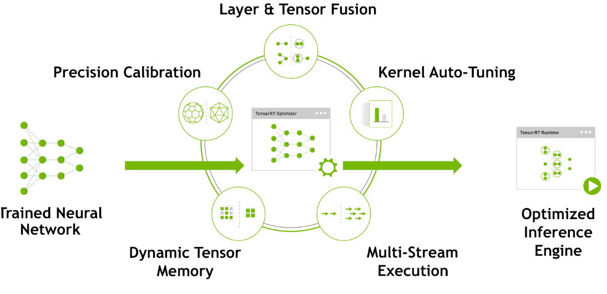
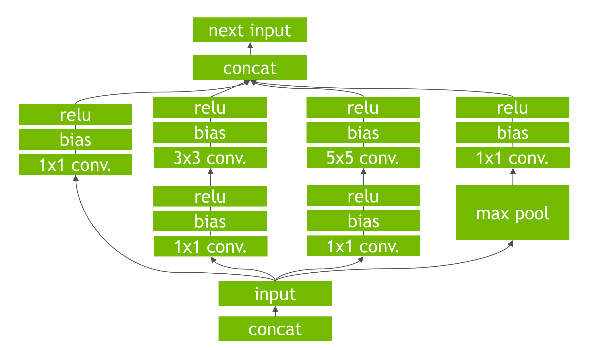
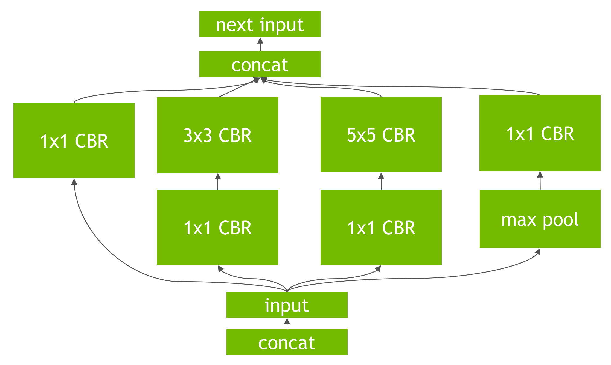
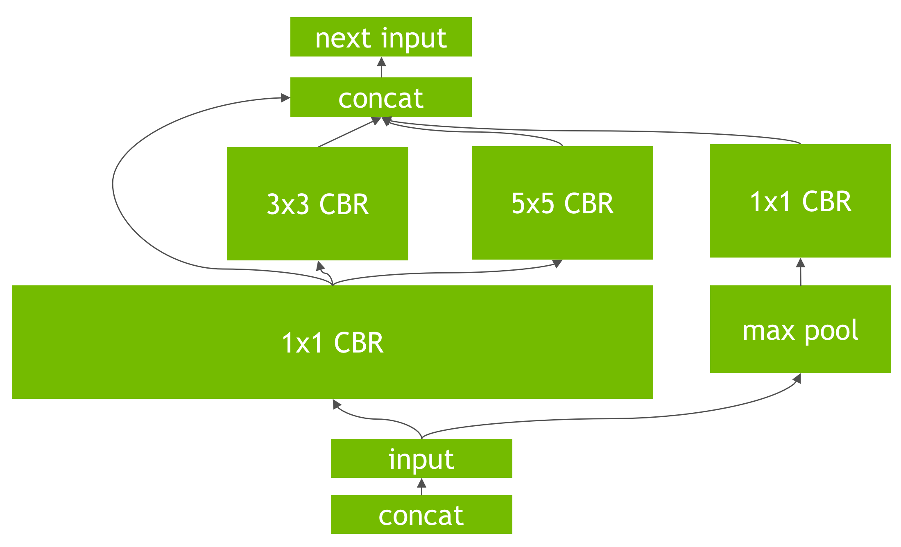
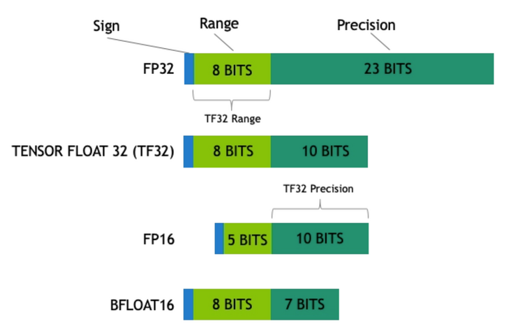
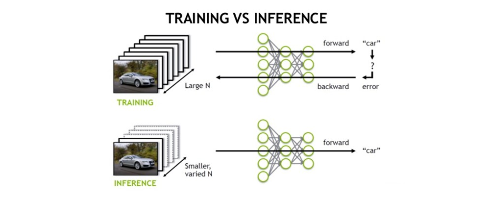
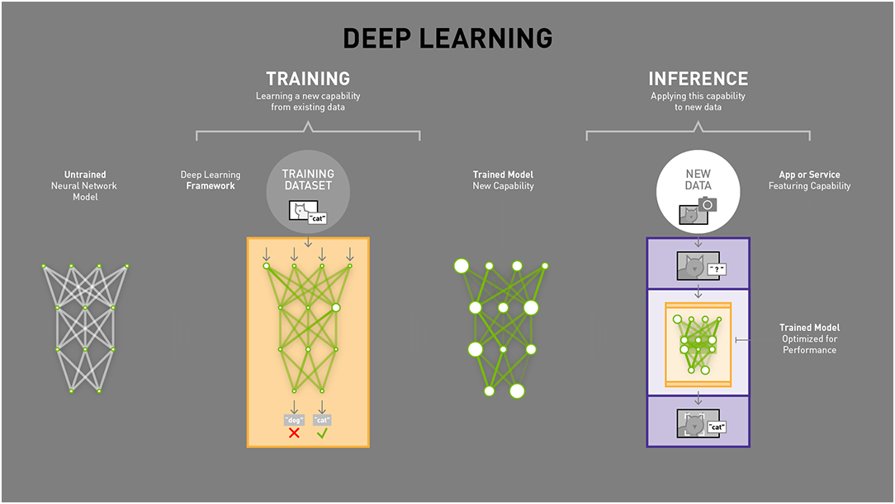

## 简介

TensorRT是用于高性能深度学习推理的SDK。包含了深度学习推理优化器和运行时环境，可为深度学习推理应用提供低延迟和高吞吐量。

TensorRT支持主流的TensorFlow、Pytorch、Caffe、Mxnet、PaddlePaddle等深度学习框架。

TensorRT是一个C++库，并提供C++ API和Python API，主要针对相应的NVIDIA GPU进行高性能推理（inference）加速。

<!--more-->

## 优化方式与原理

### Layer & Tensor Fusion

未使用的输出层被删除，一避免不必要的计算。

在允许的情况下convolution, bias, and ReLU层被融合，形成一个单一的层，图3显示了图2的原始网络进行垂直层融合的结果(融合的层标记为CRB)。层融合提高了在GPU上运行TensorRT优化的网络的效率。

另外一种是水平层融合，或者说层聚合，同时要求将聚合的层划分到各自的输出。水平层融合通过将采取相同的源张量并以类似的参数应用相同的操作的层结合起来提高性能，从而形成一个更大的层以获得更高的计算效率。图4中的例子显示了图3中的3个1×1 CBR层的组合，这些层采取相同的输入，变成一个更大的1×1 CBR层。请注意，这个层的输出必须被分解，以便从原始输入图中进入不同的后续层。

在部署模型推理时，这每一层的运算操作都是由GPU完成的，但实际上是GPU通过启动不同的CUDA（Compute unified device architecture）核心来完成计算的，CUDA核心计算张量的速度是很快的，但是往往大量的时间是浪费在CUDA核心的启动和对每一层输入/输出张量的读写操作上面，这造成了内存带宽的瓶颈和GPU资源的浪费。

TensorRT通过对层间的横向或纵向合并（合并后的结构称为CBR，意指 convolution, bias, and ReLU layers are fused to form a single layer），使得层的数量大大减少。横向合并可以把卷积、偏置和激活层合并成一个CBR结构，只占用一个CUDA核心。纵向合并可以把结构相同，但是权值不同的层合并成一个更宽的层，也只占用一个CUDA核心。合并之后的计算图的层次更少了，占用的CUDA核心数也少了，因此整个模型结构会更小，更快，更高效。

### 数据精度校准

一般情况下深度学习框架在训练神经网络时网络中的张量（Tensor）都是32位浮点数的精度（Full 32-bit precision，FP32），在网络训练完成后，部署推理的过程中由于不需要反向传播，可以适当降低数据精度，比如降为FP16或INT8的精度。更低的数据精度将会使得内存占用和延迟更低，模型体积更小。

- FP32：单精度浮点型，没什么好说的，深度学习中最常见的数据格式，训练推理都会用到；
- FP16：半精度浮点型，相比FP32占用内存减少一半，有相应的指令值，速度比FP32要快很多；
- TF32：第三代Tensor Core支持的一种数据类型，是一种截短的 Float32 数据格式，将FP32中23个尾数位截短为10bits，而指数位仍为8bits，总长度为19(=1+8 +10)。保持了与FP16同样的精度(尾数位都是 10 位），同时还保持了FP32的动态范围指数位都是8位)；
- INT8：整型，相比FP16占用内存减小一半，有相应的指令集，模型量化后可以利用INT8进行加速。

INT8只有256个不同的数值，使用INT8来表示 FP32精度的数值，肯定会丢失信息，造成性能下降。不过TensorRT会提供完全自动化的校准（Calibration ）过程，会以最好的匹配性能将FP32精度的数据降低为INT8精度，最小化性能损失。

### Kernel Auto-Turing

网络模型在推理计算时，是调用GPU的CUDA核进行计算的。TensorRT可以针对不同的算法，不同的网络模型，不同的GPU平台，进行 CUDA核的调整，以保证当前模型在特定平台上以最优性能计算。

### Dynamic Tensor Memory

在每个tensor的使用期间，TensorRT会为其指定显存，避免显存重复申请，减少内存占用和提高重复使用效率。

### Multi-Stream Execution

并行处理多个输入流的可拓展设计

### 关于训练与推理的区别

TensorRT可以将网络模型解析，然后与TensorRT中对应的层进行映射，将其他框架的模型全部转换到TensorRT中，然后使用NVIDIA自家的优化策略对GPU推理进行加速。

### 关于GPU硬件

不同GPU，其核心数量、频率、架构、设计都是不一样的，TensorRT需要对特定的硬件进行优化，不同硬件之间的优化是不能共享的。

## 模型转换

目前提供三种转换模型的方式：

- 使用TF-TRT，将TensorRT集成在TensorFlow中
- 使用[onnx-tensorrt](https://github.com/onnx/onnx-tensorrt)
- 手动构造模型结构，然后将权重信息导入

TensorRT对Pytorch的支持更为友好，除了Pytorch->ONNX->TensorRT，还有[torch2trt](https://github.com/NVIDIA-AI-IOT/torch2trt)、[torch2trt_dynamic](https://github.com/grimoire/torch2trt_dynamic)、[TRTorch](https://github.com/NVIDIA/TRTorch)。

## 部署TensorRT方式

- 集成在Tensorflow中使用，比例TF-TRT，这种操作起来比较便捷，但是加速效果并不是很好；
- 在TensorRT Runtime环境中运行模型，就是直接使用TensorRT；
- 搭配服务框架使用，最配的就是官方的triton-server，完美支持TensorRT。
