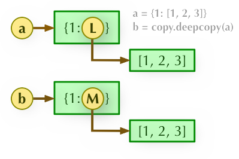

### 深浅拷贝

- **直接赋值：**其实就是对象的引用（别名）。
- **浅拷贝(copy)：**拷贝父对象，不会拷贝对象的内部的子对象。
- **深拷贝(deepcopy)：** copy 模块的 deepcopy 方法，完全拷贝了父对象及其子对象，两个变量所指的物理内存地址不同。

<!-- more -->

#### 直接赋值

**b = a:** 赋值引用，a 和 b 都指向同一个对象。


#### 浅拷贝

**b = a.copy():** 浅拷贝, a 和 b 是一个独立的对象，但他们的子对象还是指向统一对象（是引用）。


#### 深拷贝

**b = copy.deepcopy(a):** 深度拷贝, a 和 b 完全拷贝了父对象及其子对象，两者是完全独立的。




```python
import copy
a = [1, 2, 3, 4, ['a', 'b']]  # 原始对象

b = a  # 赋值，传对象的引用
c = copy.copy(a)  # 对象拷贝，浅拷贝
d = copy.deepcopy(a)  # 对象拷贝，深拷贝

a.append(5)  # 修改对象a
a[4].append('c')  # 修改对象a中的['a', 'b']数组对象

print('a = ', a)
print('b = ', b)
print('c = ', c)
print('d = ', d)

'''输出结果为：'''
a =  [1, 2, 3, 4, ['a', 'b', 'c'], 5]
b =  [1, 2, 3, 4, ['a', 'b', 'c'], 5]
c =  [1, 2, 3, 4, ['a', 'b', 'c']]
d =  [1, 2, 3, 4, ['a', 'b']]
```


#### append() 函数

当 list 类型的对象进行 append 操作时，实际上追加的是该对象的引用。

**id()** 函数：返回对象的唯一标识，可以类比成该对象在内存中的地址。

```python
alist = []
num = [2]
alist.append(num)
print(id(num) == id(alist[0]))
print(num, alist)
num[0] = 3
print(id(num) == id(alist[0]))
print(num, alist)

'''输出结果为：'''
True
[2] [[2]]
True
[3] [[3]]
```

当 num 发生变化时(前提是 id(num) 不发生变化），alist 的内容随之会发生变化。往往会带来意想不到的后果，想避免这种情况，可以采用深拷贝解决：

```python
alist.append(copy.deepcopy(num))
```

