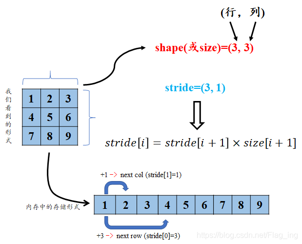
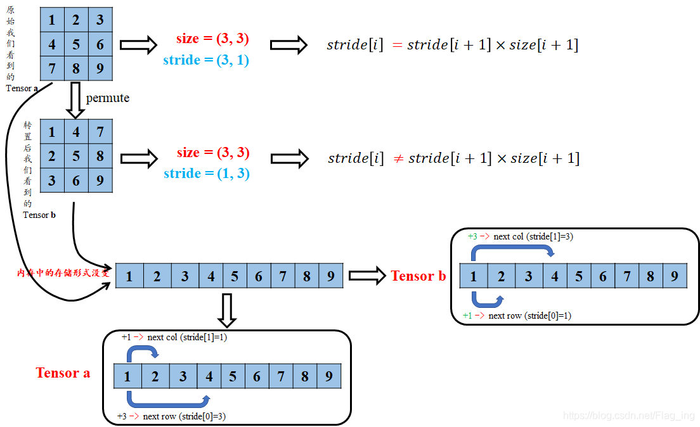

关于PyTorch张量存储的底层原理：tensor的头信息区（Tensor）和存储区 （Storage）以及tensor的步长Stride。
<!-- more -->


## PyTorch张量存储的底层原理

tensor数据采用头信息区（Tensor）和存储区 （Storage）分开存储的形式，如图1所示。变量名以及其存储的数据是分为两个区域分别存储的。比如，我们定义并初始化一个tensor，tensor名为A，A的形状size、步长stride、数据的索引等信息都存储在头信息区，而A所存储的真实数据则存储在存储区。另外，如果我们对A进行截取、转置或修改等操作后赋值给B，则B的数据共享A的存储区，存储区的数据数量没变，变化的只是B的头信息区对数据的索引方式，这种方式其实就是浅拷贝。


```python
import torch
a = torch.arange(5)  # 初始化张量 a 为 [0, 1, 2, 3, 4]
b = a[2:]            # 截取张量a的部分值并赋值给b，b其实只是改变了a对数据的索引方式
print('a:', a)
print('b:', b)
print('ptr of storage of a:', a.storage().data_ptr())  # 打印a的存储区地址
print('ptr of storage of b:', b.storage().data_ptr())  # 打印b的存储区地址,可以发现两者是共用存储区
 
print('==================================================================')
 
b[1] = 0    # 修改b中索引为1，即a中索引为3的数据为0
print('a:', a)
print('b:', b)
print('ptr of storage of a:', a.storage().data_ptr())  # 打印a的存储区地址,可以发现a的相应位置的值也跟着改变，说明两者是共用存储区
print('ptr of storage of b:', b.storage().data_ptr())  # 打印b的存储区地址
 
 
'''   运行结果   '''
a: tensor([0, 1, 2, 3, 4])
b: tensor([2, 3, 4])
ptr of storage of a: 2862826251264
ptr of storage of b: 2862826251264
==================================================================
a: tensor([0, 1, 2, 0, 4])
b: tensor([2, 0, 4])
ptr of storage of a: 2862826251264
ptr of storage of b: 2862826251264
```

### PyTorch张量的步长（stride）属性

tensor的步长可以理解为从索引中的一个维度跨到下一个维度中间的跨度。



```python
import torch
a = torch.arange(6).reshape(2, 3)  # 初始化张量 a
b = torch.arange(6).view(3, 2)     # 初始化张量 b
print('a:', a)
print('stride of a:', a.stride())  # 打印a的stride
print('b:', b)
print('stride of b:', b.stride())  # 打印b的stride
 
'''   运行结果   '''
a: tensor([[0, 1, 2],
           [3, 4, 5]])
stride of a: (3, 1)
 
b: tensor([[0, 1],
           [2, 3],
           [4, 5]])
stride of b: (2, 1)
```

## 视图与副本的理解

视图是数据的一个别称或引用，通过该别称或引用亦便可访问、操作原有数据，但原有数据不会产生拷贝。如果我们对视图进行修改，它会影响到原始数据，物理内存在同一位置，这样避免了重新创建张量的高内存开销。由上面介绍的PyTorch的张量存储方式可以理解为：对张量的大部分操作就是视图操作！

与之对应的概念就是副本。副本是一个数据的完整的拷贝，如果我们对副本进行修改，它不会影响到原始数据，物理内存不在同一位置。

有关视图与副本在NumPy中的应用，在中[这里](https://huffman-cotdom.github.io/2021/11/09/numpy%E4%B8%AD%E8%A7%86%E7%AA%97%E4%B8%8E%E5%89%AF%E6%9C%AC%E7%9A%84%E5%8E%9F%E7%90%86/#more)有详细介绍。

## Tensor的连续性

Tensor的物理地址连续需要满足公式1，具体逻辑可以看图二。
$$
stride[i]=stride[i+1]*size[i+1]
$$
**实例：**

初始化一个张量 a ，并查看其stride、storage等属性：

```python
import torch
a = torch.arange(9).reshape(3, 3)  # 初始化张量a
print('struct of a:\n', a)
print('size   of a:', a.size())    # 查看a的shape
print('stride of a:', a.stride())  # 查看a的stride
 
'''   运行结果   '''
struct of a:
tensor([[0, 1, 2],
        [3, 4, 5],
        [6, 7, 8]])
size   of a: torch.Size([3, 3])
stride of a: (3, 1)   # 注：满足连续性条件
```

把上面的结果带入式1，可以发现满足tensor连续性条件。

进一步处理——对a进行转置后的结果：

```python
import torch
a = torch.arange(9).reshape(3, 3)     # 初始化张量a
b = a.permute(1, 0)  # 对a进行转置
print('struct of b:\n', b)
print('size   of b:', b.size())    # 查看b的shape
print('stride of b:', b.stride())  # 查看b的stride
 
'''   运行结果   '''
struct of b:
tensor([[0, 3, 6],
        [1, 4, 7],
        [2, 5, 8]])
size   of b: torch.Size([3, 3])
stride of b: (1, 3)   # 注：此时不满足连续性条件
```

 将a转置后再看最后的输出结果，带入到式1中，发现等式不成立。

```python
import torch
a = torch.arange(9).reshape(3, 3)             # 初始化张量a
print('ptr of storage of a: ', a.storage().data_ptr())  # 查看a的storage区的地址
print('storage of a: \n', a.storage())        # 查看a的storage区的数据存放形式
b = a.permute(1, 0)                           # 转置
print('ptr of storage of b: ', b.storage().data_ptr())  # 查看b的storage区的地址
print('storage of b: \n', b.storage())        # 查看b的storage区的数据存放形式
 
'''   运行结果   '''
ptr of storage of a:  2767173747136
storage of a: 
  0
 1
 2
 3
 4
 5
 6
 7
 8
[torch.LongStorage of size 9]
ptr of storage of b:  2767173747136
storage of b:
  0
 1
 2
 3
 4
 5
 6
 7
 8
[torch.LongStorage of size 9]
```

由结果可以看出，张量a、b仍然共用存储区，并且存储区数据存放的顺序没有变化，这也充分说明了b与a共用存储区，b只是改变了数据的索引方式。但是问题来了，为啥转置之后等式不成立呢？



转置后的tensor只是对storage区数据索引方式的重映射，但原始的存放方式并没有变化.因此，这时再看tensor b的stride，从b第一行的元素1到第二行的元素2，显然在索引方式上已经不是原来+1了，而是变成了新的+3了。

此时就不能用view来对b进行shape的改变：

```python
import torch
a = torch.arange(9).reshape(3, 3)             # 初始化张量a
print(a.view(9))
print('============================================')
b = a.permute(1, 0)  # 转置
print(b.view(9))
 
'''   运行结果   '''
tensor([0, 1, 2, 3, 4, 5, 6, 7, 8])
============================================
Traceback (most recent call last):
  File "/Users/bytedance/learning/pytorch/tensor基本操作.py", line 24, in <module>
    print(b.view(9))
RuntimeError: view size is not compatible with input tensor's size and stride (at least one dimension spans across two contiguous subspaces). Use .reshape(...) instead.
```

此时直接使用`view()`就不行，需要使用`contiguous()`方法将原始tensor转换为满足连续条件的tensor，在使用view进行shape变换，值得注意的是，这样的原理是`contiguous()`方法开辟了一个新的存储区给b，并改变了b原始存储区数据的存放顺序！

```python
import torch
a = torch.arange(9).reshape(3, 3)      # 初始化张量a
print('storage of a:\n', a.storage())  # 查看a的stride
print('+++++++++++++++++++++++++++++++++++++++++++++++++')
b = a.permute(1, 0).contiguous()       # 转置,并转换为符合连续性条件的tensor
print('size    of b:', b.size())       # 查看b的shape
print('stride  of b:', b.stride())     # 查看b的stride
print('viewd      b:\n', b.view(9))    # 对b进行view操作，并打印结果
print('+++++++++++++++++++++++++++++++++++++++++++++++++')
print('storage of a:\n', a.storage())  # 查看a的存储空间
print('storage of b:\n', b.storage())  # 查看b的存储空间
print('+++++++++++++++++++++++++++++++++++++++++++++++++')
print('ptr of a:\n', a.storage().data_ptr())  # 查看a的存储空间地址
print('ptr of b:\n', b.storage().data_ptr())  # 查看b的存储空间地址
 
'''   运行结果   '''
storage of a:
  0
 1
 2
 3
 4
 5
 6
 7
 8
[torch.LongStorage of size 9]
+++++++++++++++++++++++++++++++++++++++++++++++++
size    of b: torch.Size([3, 3])
stride  of b: (3, 1)
viewd      b:
 tensor([0, 3, 6, 1, 4, 7, 2, 5, 8])
+++++++++++++++++++++++++++++++++++++++++++++++++
storage of a:
 0
 1
 2
 3
 4
 5
 6
 7
 8
[torch.LongStorage of size 9]
storage of b:
 0
 3
 6
 1
 4
 7
 2
 5
 8
[torch.LongStorage of size 9]
+++++++++++++++++++++++++++++++++++++++++++++++++
ptr of a:
 1842671472000
ptr of b:
 1842671472128
```

由上述结果可以看出，张量a与b已经是两个存在于不同存储区的张量了。也印证了`contiguous()`方法开辟了一个新的存储区给b，并改变了b原始存储区数据的存放顺序。这种开辟一个新的内存区的方式其实就是深拷贝。
